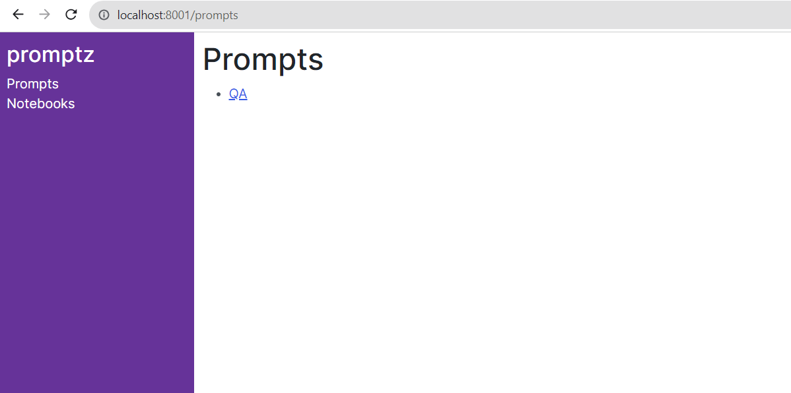

# Apps

:::caution
*Warning: this is an experimental feature and is subject to change.*
:::

You can use **promptz** as a library or a framework. For simple use cases, or integrating into existing codebase, library usage is the way to go. But, if you're starting a new project or want to centralize LLM access via an API, creating an app provides a quick way to get started by generating an API, admin interface, and cli for you to interact with your prompts and collections.

## Setup

Let's create a new app:

```bash
pz create my-app
cd my-app
```

This will create a new directory called `my-app` with the following structure:

```
my-app
├── admin
├── notebooks
├── prompts
├── systems
├── app.py
├── README.md
```

The `app.py` file is the entry point of your app and is where you can configure settings like LLMs, databases, etc. Here's what the generated `app.py` looks like:

```python
from promptz import App

def create_app():
    app = App()
    return app

if __name__ == "__main__":
    app = create_app()
    app.serve()
```

This is the bare minimum to get your app running using a mock LLM. Let's run it:

```bash
python app.py
```

This does a few things. First, it loads all prompts, notebooks, systems, and admin pages from the relevant directories (we'll go through what each of these mean below). Then it starts a FastAPI server and Dash admin app - by default these are available at `http://localhost:8000` and `http://localhost:8001` respectively.

We can test that everything is working by calling the prompt API:

```bash
curl -X POST http://localhost:8000/api/prompt -d '{"input": "What is the capital of France?"}'
>>> 'This is a mock response'
```

The API is working, but because we haven't configured an LLM it will default to the mock LLM. Let's setup ChatGPT by adding the following to `app.py`:

```python
import os
from promptz import App, ChatGPT

llm = ChatGPT(
    api_key=os.getenv('OPENAI_API_KEY'),
    org_id=os.getenv('OPENAI_ORG_ID'),
)

def create_app():
    app = App(llm=llm)
    return app

if __name__ == "__main__":
    app = create_app()
    app.serve()
```

Now, if we curl the API again we should get a response from ChatGPT:

```bash
curl -X POST http://localhost:8000/prompts -d '{"input": "What is the capital of France?"}'
>>> 'The capital of France is Paris.'
```

## Prompts

This can be useful as a way to centralize access to LLMs across an organization, but you can also create predefined prompts that can then be triggered from the API. Let's create a new prompt by adding a JSON file to the `/prompts` directory:

```json
{
    "name": "qa",
    "instructions": "Answer the question with a factual answer.",
    "examples": [
        {
            "input": "What is the capital of France?",
            "output": "Paris"
        }
    ],
}
```

Now, once we restart the app to load the new prompt, we can trigger the stored prompt from the API:

```bash
curl -X POST http://localhost:8000/prompts/qa/run -d '{"input": "What is the capital of Germany?"}'
>>> 'Berlin'
```

You can also trigger prompts from the cli:

```bash
pz prompts run qa "What is the capital of Germany?"
>>> 'Berlin'
```

## Admin

Next, let's look at the admin interface. By default, admin pages are created for prompts, notebooks, systems, and collections using the **Dash** framework. If you navigate to `http://localhost:8001/prompts` you'll see a list of all the prompts that you have created. Click on the `qa` prompt and you'll see something like:



Currently, you can only update prompts in code, but you can trigger them and see a log of past results from the admin page.

:::caution
The admin interface is still in a very early stage of development. Prompts and notebooks are the only things that are currently supported, but we plan to add support for systems and collections soon as well as support for custom admin pages.
:::

## Notebooks

**Notebooks** are loaded from the `/notebooks` directory and can be viewed from the admin interface. They are rendered as html using `nbconvert` and provide a simple way to share experiments, reports, etc. with others.

To initialize a notebook with the current state of the app, you can import the `create_app` function from `app.py` and use it to create a new **session**:

```python
from ../app import create_app

app = create_app()
session = app.world.create_session()

session.prompt('What is the capital of France?')
>>> 'Paris'
```

Alternatively, you can set the default session, which will bind the top-level helpers to it:

```python
from promptz import set_default_session

set_default_session(session)
prompt('What is the capital of France?')
>>> 'Paris'
```

## Systems

The structure of **Apps** are inspired by **entity-component-systems** from game development, where the stored embeddings act as the entities/components. **Systems** let you define some transformation logic on stored entities, much like you would define models to update data in **dbt**.

Here's a simple example that updates the age of all villain characters:

```python
from promptz import System

class UpdateAge(System):
    query = Query(
        'they are a villain',
        where={'type': 'character'}
    )

    def process(self, entities):
        entities['age'] = entities['age'] + 1
        return entities
```

**Systems** are loaded into the app from the `/systems` directory. To run all systems, you can call the app's world instance with a session:

```python
session = app.world.create_session()
app.world(session)
```

Or call this from the API or cli:

```bash
curl -X POST http://localhost:8000/systems/run

# cli usage
pz systems run
```

This will run all systems in the order defined. Support for running individual systems and subsets of systems is will be added soon.