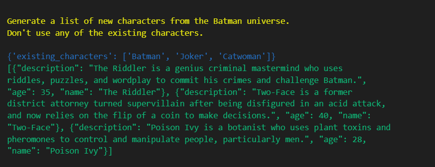
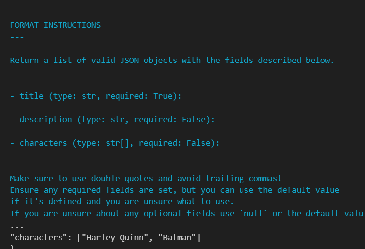

# Config

## LLMs

To set a default LLM you can set it on the current `Session`. For example, here's how to use `ChatGPT` as the default LLM in a notebook:

```python
import os
import promptz

llm = promptz.ChatGPT(
    api_key=os.environ['OPENAI_API_KEY'],
    org_id=os.environ['OPENAI_ORGANIZATION_ID'],
)

promptz.init(llm=llm)

promptz.prompt("What is the capital of France?")
>>> 'Paris'
```

You can override this default by passing an LLM to the `prompt` function:

```python
llm = MyCheapDevLLM()
promptz.prompt("What is the capital of France?", llm=llm)
```

This allows you to easily create multi-modal workflows or use private models for specific tasks.

```python
sd = StableDiffusion()
city = promptz.prompt("What is the capital of France?")
image = promptz.prompt(f'Draw a picture of {city}?', llm=sd)
>>> <image of Paris>
```

## Logging

By default, **promptz** uses a custom logging formatter designed to make it easy to read prompt input/outputs from a notebook. Yellow text is the instructions, blue is any input, and green is the output:



If you pass `debug=True` to the `prompt` function, it will also show any examples in purple and any formatting instructions in teal:



However, in production environments JSON logging is preferred to integrate with log aggregators.

```python
import promptz

promptz.init(log_format='json')
```

## Error handling

Output from LLMs can be unpredictable. **promptz** provides validation through **Pydantic** models, but what happens when a model is unable to generate a valid response? 

By default, a prompt will retry 3 times before throwing an error, but you can change this by setting the `reties=` parameter:

```python
from promptz import prompt

prompt("What is the capital of France?", retries=5)
```