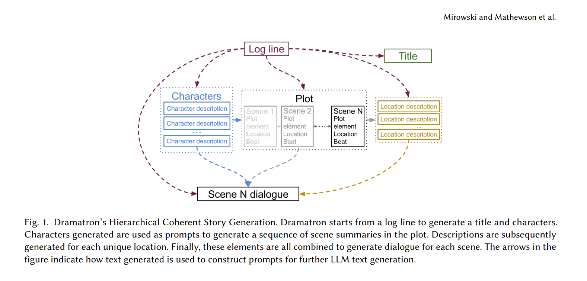

## Dramatron

Implementation of Dramatron, Deepmind's generative story prompt model, which starts with a logline and progressively builds elements of a story ending with dialogue for each scene.

### Output

This is a generated script (using GPT-4) for the first scene using The Matrix as the logline.

> INT. NEO'S APARTMENT - NIGHT
 
 The room is dimly lit by the glow of multiple computer monitors, the hum of processors hanging in the air. Stacks of papers, computer parts strewn about, and the rapid flicker of code tracing across the screens.
  
  
 NEO, a man caught between reality and the digital world, sits hunched over the mass of technology, his fingers moving with a practiced ease over the keyboard. He hacks away, oblivious to the world outside his door.
  
  
 Suddenly, a knock JOLTS him from his trance. He glances at the time - 3:00 AM. He looks at his computer screen. The hacking effort halted, half-finished lines of code hanging in the digital ether.\n\nAnother KNOCK, louder this time. Neo stirs, stands up slowly, stretching his tired muscles. Curiosity piques him, he moves to open the door.
  
  
 INT. NEO'S APARTMENT - MORNING
  
  
 The sun rises, revealing the stark contrast of Neo's reality. A whole other life filled with paperwork, sterile cubicles and menial tasks. The simple monotony a stark contrast to the thrill and wonder of the night before.\n\nNeo looks at the solar glare reflecting off the glass buildings, a world of illusions. He takes a deep breath and prepares himself for another day in the ordinary world.

And this is the generated script using Westworld as the logline.

> DR. ROBERT FORD
 
Visitors to Westworld, welcome. This isn\'t your average theme park.\n
 
 
WILLIAM
 
This feels... it\'s almost too real.
 
 
DR. ROBERT FORD
 
That\'s the brilliance of it, William. The hosts aren\'t mere robots. They mimic human forms, mannerisms, and even emotions. You won\'t find anywhere else quite like Westworld.
 
 
(DOLORES ABERNATHY approaches WILLIAM)
 
 
DOLORES ABERNATHY
 
Good day, sir. Anything you fancy doing today?
 
 
WILLIAM
 
You\'re... You\'re just like us...
 
 
DOLORES ABERNAT
 
(Polite smile)
 
Why, thank you, sir. Enjoy your stay.
 
 
(Cuts to BERNARD LOWE observing from a distance)
 
 
BERNARD LOWE
 
Dolores seems particularly realistic today.
 
 
DR. ROBERT FORD
 
Each day, she becomes more and more aware... Blurring the line between artificial intelligence and consciousness.
 
 
(MAEVE MILLAY appears performing her role)
 
 
MAEVE MILL
 
Gentlemen, welcome to Sweetwater\'s finest brothel. Shall we indulge in some fantasies?
 
 
(They all watch as high-paying tourists laugh, play, and revel in the park, indulging in their wildest, most imaginative fantasies.)

